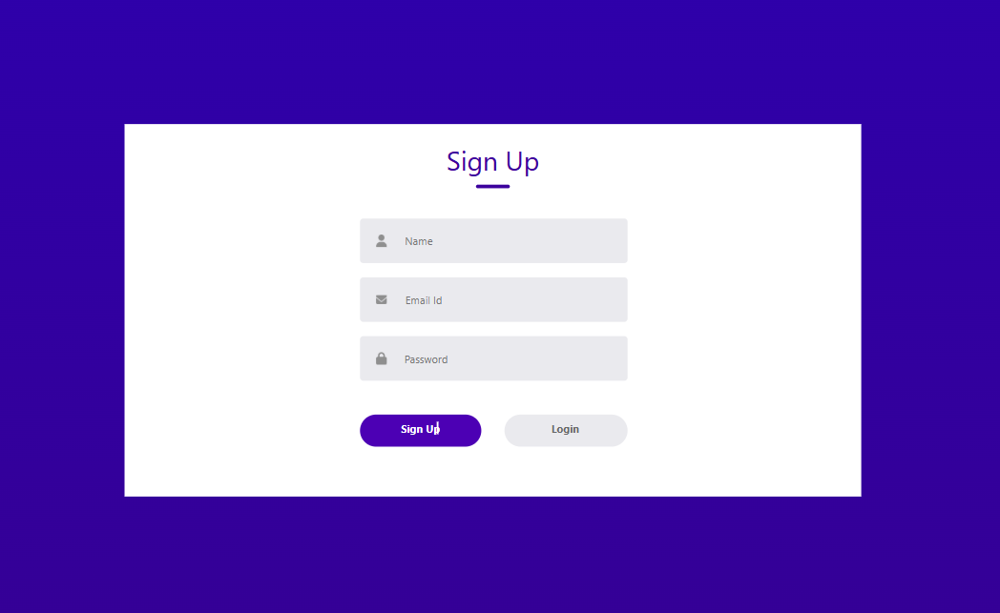
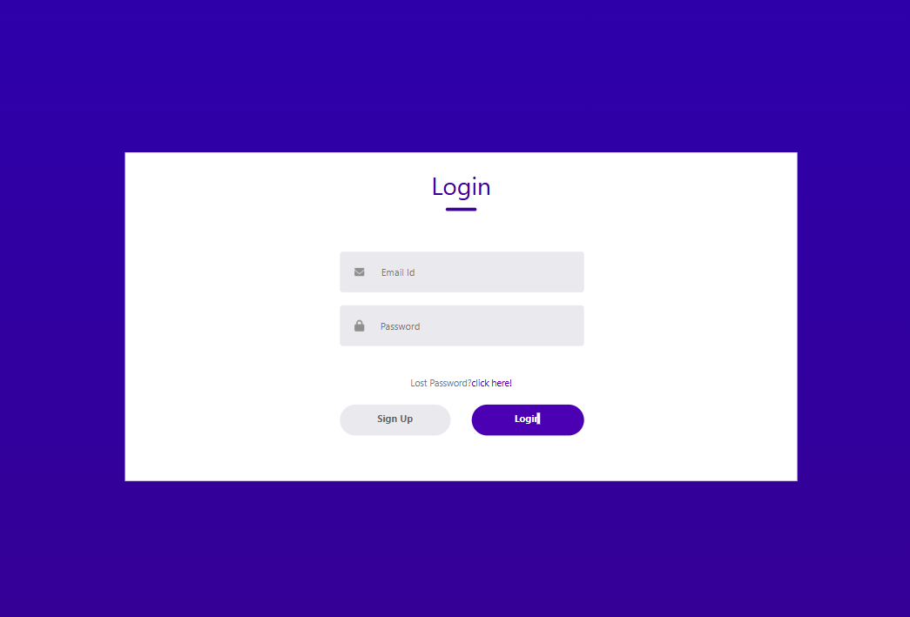

Login and Signup Page

Overview:
A responsive login and signup interface built with React.js, HTML, CSS, and JavaScript. It allows users to toggle between forms with smooth transitions and includes basic form validation.
 

<h1> Login_SignUp_App</h1>

 
 <h1>
 </h1>

 

<h1> Login_SignUp_App</h1>

 
 <h1>
 </h1>

 
1.Features:

  -> React-based component structure
  
  -> Toggle between Login and Signup
  
  -> Responsive design
  
  -> Basic form validation
 
 
 
2.How to Use:

  -> Clone the repo
  
  -> Run npm install
  
  -> Start the app with npm start
 
 
 
3.Future Improvements:

  -> Backend API integration
  
  -> Advanced validations and animations
